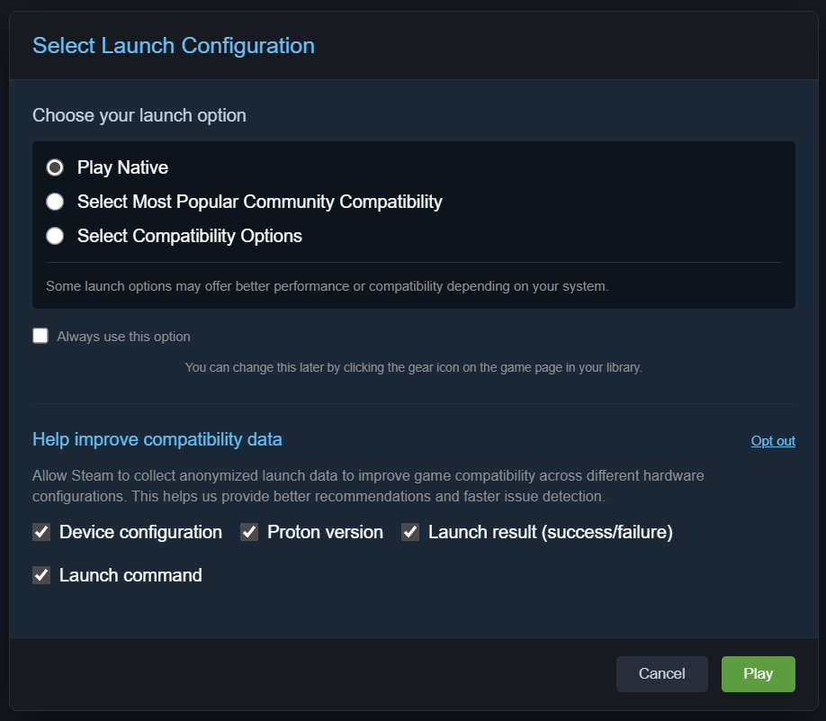

# Steam Ecosystem Improvement Proposals

This repository contains a set of practical proposals aimed at improving the Steam ecosystem, based on real user experience and an engineering mindset.

The main goals are to improve:

- usability
- system transparency
- platform resilience
- community engagement

## About Me

I am a long-time Steam user and enthusiast, as well as a DevOps engineer with ~5 years of experience.

In my daily work, I focus on:

- system observability
- infrastructure reliability
- user experience analysis

This repository is my attempt to contribute practical, technically grounded improvements to the Steam ecosystem.

I am currently **open to new opportunities** and would love to bring my skills and passion for Steam to the **Valve** team, helping evolve the platform and its products in line with Valve’s user-first philosophy.

## Repository Structure

### Ideas

A collection of key improvement proposals:

1. Steam UI — redesign focused on wide-screen utilization  
2. Apps Page — game page with ProtonDB-like insights and enhanced reviews  
3. Compatibility Window — structured data collection on game launches  
4. Steam Logs — human-readable centralized failure diagnostics  
5. Community Board — centralized feedback system  
6. Archives — preservation of digital history  
7. Mod Integrations — integration of mod managers and tools  
8. Package Mirror — mirrored package infrastructure for SteamOS  
9. Devices — expansion of Valve hardware ecosystem  
10. Merch — community-driven merchandise ecosystem  

---

### Prototypes

UI prototypes for selected ideas:

### 1. Steam UI — Wide-Screen Utilization

*Demonstration of horizontal layout, sidebar sliding.*

### 2. Apps Page — Enhanced Game Page

*Sticky sidebar, nlp review, review filters, technical details toggle.*

### 3. Compatibility Window — Launch Data Collection

*First‑launch dialog with privacy controls and data collection simulation.*

## Approach

These proposals are based on the following principles:

- Using horizontal space instead of excessive vertical scrolling  
- System transparency instead of "black box" behavior  
- Observability of user experience  
- Reuse of existing infrastructure (e.g., Steam CDN)  
- Strengthening the role of the community as a data source  

---

## How to View Prototypes

Open HTML files from the `prototypes` folder in your browser:

- `prototypes/1_steam-ui/index.html`
- `prototypes/2_apps/index.html`
- `prototypes/3_compatibility-window/index.html`

No build steps or dependencies are required.

---

## Why This Matters

Steam is already the largest game distribution platform, however:

- the UI does not always scale well for modern displays  
- compatibility and performance data is fragmented  
- user feedback is scattered across multiple platforms  

These proposals aim to address these issues with minimal architectural disruption.

## Open to Opportunities

Currently looking for roles at Valve Software (Steam / SteamOS / Infrastructure / Platform teams).  
Feel free to reach out if you see value in these proposals!

<https://www.linkedin.com/in/kirill-bayrol-363915235/>
